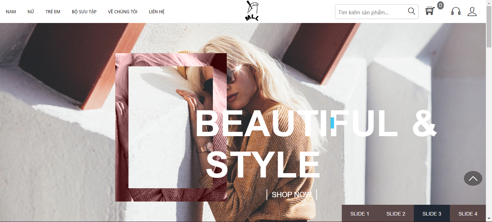
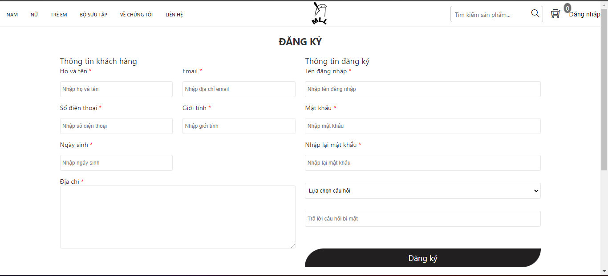
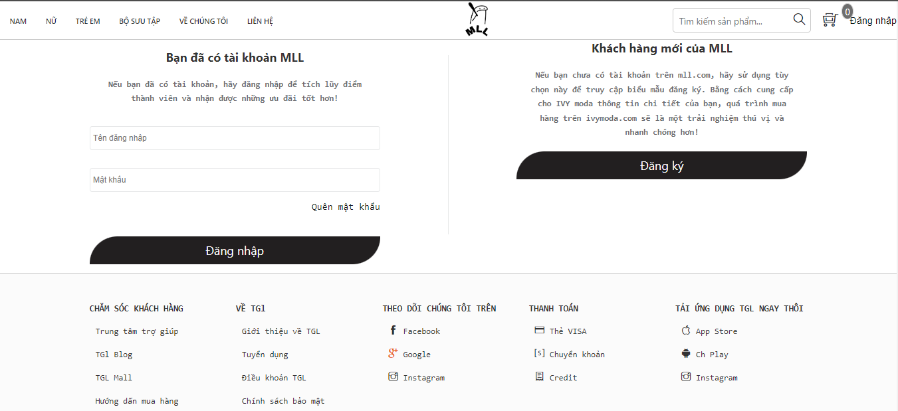
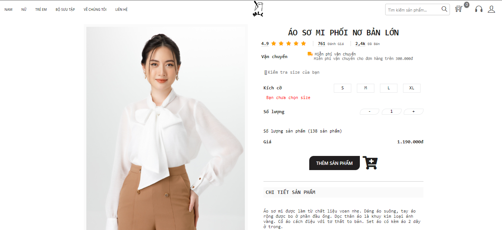
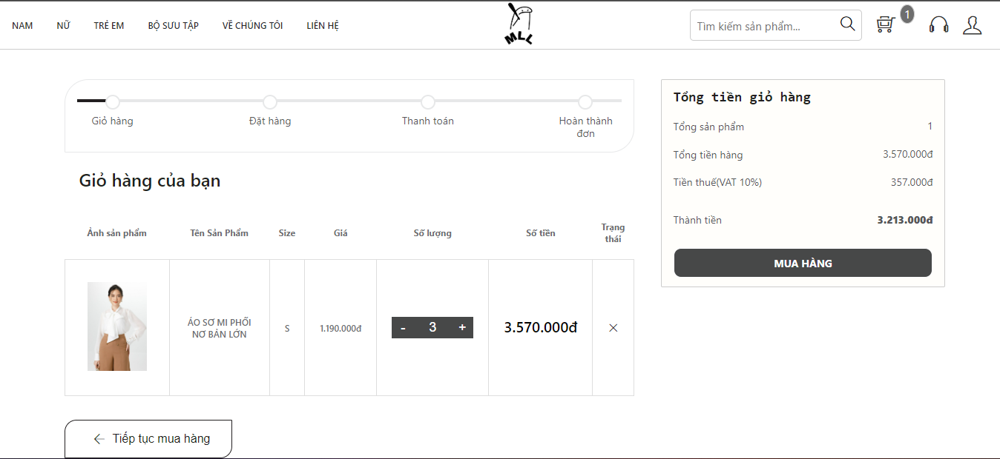
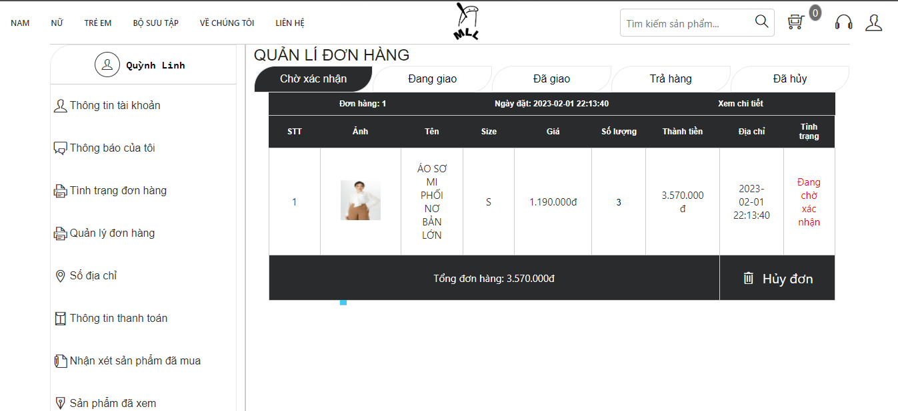
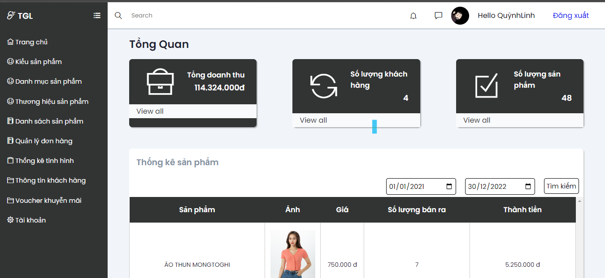
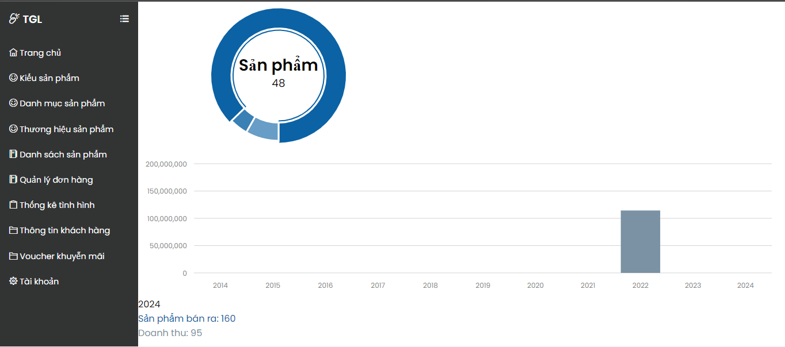

<<<<<<< HEAD
# DACKST2
=======
# Fashion product sale website

## Project Description:
This is the website that the team did during the learning process, this is the age of technology, so users mainly shop through websites.
Seizing that opportunity, the team built a website to help customers access the store on a small scale by buying goods through online clearance.
## Tech Stack Used:
```bash
FrontEnd:
    * Javascript
    * CSS
    * HTML
BackEnd:
    * PHP
Database:
    * MySql
```
## Website Functions:
For users:
```bash
* Login / registration function
* Function to add products to cart
* Product search/category function
* User function can view/edit personal information
* User function can manage orders (pending / confirmed / shipped / canceled) when admin has accepted
* User password change function
```
For admins:
```bash
* Admin can add/edit/delete products
* Admin can manage orders (confirm orders the user has placed)
* Admin can statistic the business situation of the store by month / quarter / year
* Admin can manage registered customer information
* Admin can build promotional vouchers for new users or major holidays
```
## Steps to run the website:
1. Clone from github and add to htdocs folder in xampp
2. Launch the application and go to the directory config -> config.php , change the names according to your Mysql
3. Add doanweb.sql in Database folder to Mysql
4. Then launch the website
## [Project Demo Link](https://www.youtube.com/watch?v=fe7uRrCEjwE)
## Some features of the site:
Home Page                   |                   Registration Page
:---------------------------------:        |      :------------------------------:
  | 

Login Page                   |                   Description Product Page
:---------------------------------:        |      :------------------------------:
  | 

Cart Page                   |                   Order Management Page
:---------------------------------:        |      :------------------------------:
  | 

Admin Page                   |                   Revenue Statistics page
:---------------------------------:        |      :------------------------------:
  | 
>>>>>>> af30094 (Lần đầu commit)
